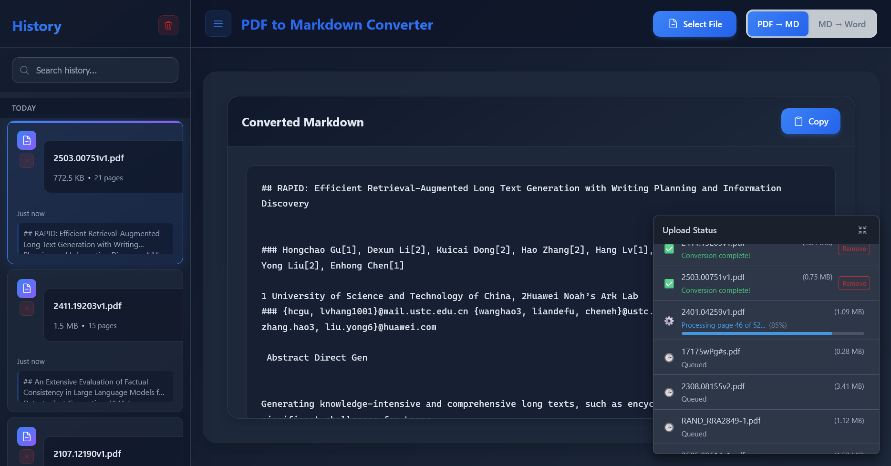
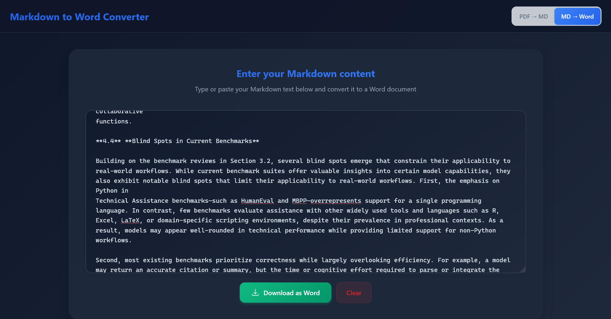

# PDF to Markdown and Word Converter

[](https://www.gnu.org/licenses/agpl-3.0)
[](https://github.com/murtaza-nasir/pdf3md/actions/workflows/build-backend-image.yml)
[](https://github.com/murtaza-nasir/pdf3md/actions/workflows/build-frontend-image.yml)

This project is dual-licensed. Please see the [License](#license) section for comprehensive details.

PDF3MD is a web application designed for efficient conversion of PDF documents into well-structured Markdown and Microsoft Word (DOCX) formats. It features a React-based frontend and a Python Flask backend, providing a seamless user experience with real-time progress updates.

## Screenshots



## Core Features

-   **PDF to Markdown Conversion**: Transforms PDF documents into clean, readable Markdown, preserving structural elements.
-   **Markdown to Word (DOCX) Conversion**: Converts user-provided Markdown text to DOCX format using Pandoc for high-fidelity output.
-   **Multi-File Upload**: Supports uploading and processing multiple PDF files simultaneously for PDF to Markdown conversion.
-   **Drag & Drop Interface**: User-friendly file uploads via drag and drop or traditional file selection.
-   **Real-time Progress Tracking**: Detailed status updates during the conversion process for each file.
-   **File Information Display**: Shows original filename, file size, page count, and conversion timestamp.
-   **Modern and Responsive UI**: Intuitive interface designed for ease of use across various devices.

## Technology Stack

-   **Frontend**: React, Vite
-   **Backend**: Python, Flask
-   **PDF Processing**: PyMuPDF4LLM
-   **Markdown to DOCX Conversion**: Pandoc

## Getting Started

The easiest and recommended way to run PDF3MD is using the provided Docker quick start script.

### Prerequisites

-   Docker Engine
-   Docker Compose (typically included with Docker Desktop)

### Using Pre-built Docker Images (Recommended)

This method uses pre-built Docker images from Docker Hub for quick setup. You'll need the `docker-compose.yml` and `docker-start.sh` script from the repository.

1.  **Prepare Required Files**:
    *   Create a directory for your application (e.g., `mkdir pdf3md-app && cd pdf3md-app`).
    *   **`docker-compose.yml`**: Create a file named `docker-compose.yml` in this directory and paste the following content into it:
        ```yaml
        services:
          backend:
            image: docker.io/learnedmachine/pdf3md-backend:latest 
            container_name: pdf3md-backend
            ports:
              - "6201:6201"
            environment:
              - PYTHONUNBUFFERED=1
              - FLASK_ENV=production
              - TZ=America/Chicago
            volumes:
              - ./pdf3md/temp:/app/temp # Creates a local temp folder for backend processing if needed
            restart: unless-stopped
            healthcheck:
              test: ["CMD", "curl", "-f", "http://localhost:6201/"]
              interval: 30s
              timeout: 10s
              retries: 3
              start_period: 40s

          frontend:
            image: docker.io/learnedmachine/pdf3md-frontend:latest 
            container_name: pdf3md-frontend
            ports:
              - "3000:3000"
            depends_on:
              - backend
            restart: unless-stopped
            healthcheck:
              test: ["CMD", "wget", "--no-verbose", "--tries=1", "--spider", "http://localhost:3000/"]
              interval: 30s
              timeout: 10s
              retries: 3
              start_period: 40s

        networks:
          default:
            name: pdf3md-network
        ```
    *   **`docker-start.sh`**: Download the `docker-start.sh` script from the [pdf3md GitHub repository's main branch](https://github.com/murtaza-nasir/pdf3md/blob/main/docker-start.sh) and place it in the same directory.
    *   Make the script executable: `chmod +x ./docker-start.sh`
    *   (Optional) For development mode using local source code (which requires cloning the full repository), you would also need `docker-compose.dev.yml` from the repository.

2.  **Start in Production Mode**:
    In the directory where you placed `docker-compose.yml` and `docker-start.sh`, run:
    ```bash
    ./docker-start.sh start
    ```
    This will pull the latest images from Docker Hub and start the application.
    -   Access Frontend: `http://localhost:3000`
    -   Access Backend API: `http://localhost:6201`

3.  **Start in Development Mode** (with hot-reloading):
    ```bash
    ./docker-start.sh dev
    ```
    This uses local source code for development if `docker-compose.dev.yml` is present and configured for local mounts. Otherwise, it may behave like production mode depending on the script's logic.
    -   Access Frontend (Vite Dev Server, if using local source): `http://localhost:5173`
    -   Access Backend API: `http://localhost:6201`
    

4.  **Other Useful Script Commands**:
    ```bash
    ./docker-start.sh stop                  # Stop all services
    ./docker-start.sh status                # Check running services
    ./docker-start.sh logs                  # View logs from services
    ./docker-start.sh rebuild dev example.com  # Rebuild development with custom domain
    ./docker-start.sh help                  # Display all available script commands
    ```

### Direct Docker Compose Usage (Alternative with Pre-built Images)

If you prefer to use Docker Compose commands directly with the pre-built images without the `docker-start.sh` script:

#### Direct Deployment

1.  **Create `docker-compose.yml`**:
    *   Create a directory for your application (e.g., `mkdir pdf3md && cd pdf3md`).
    *   Create a file named `docker-compose.yml` in this directory and paste the content provided in the section above (under "Using Pre-built Docker Images (Recommended)").

2.  **Pull and Start Services**:
    In the directory where you created `docker-compose.yml`, run:
    ```bash
    docker compose pull # Pulls the latest images specified in docker-compose.yml
    docker compose up -d
    ```

3.  **Access Application**: 
    - With default settings: Frontend at `http://localhost:3000`, Backend API at `http://localhost:6201`
    - With custom domain: Frontend at `http://example.com:3000`, Backend API at `http://example.com:6201`
4.  **Stop Services**:
    ```bash
    docker compose down
    ```

#### Development Environment (Using Local Source Code)

This setup is for developing the application locally, not using pre-built images for development.

1.  **Clone the Repository**:
    ```bash
    git clone https://github.com/murtaza-nasir/pdf3md.git
    cd pdf3md
    ```
2.  **Start Services**:
    Use the `docker-compose.dev.yml` file, which is typically configured to build images locally and mount source code.
    ```bash
    docker compose -f docker-compose.dev.yml up --build
    ``` 
3.  **Access Application**: 
    - With default settings: Frontend (Vite) at `http://localhost:5173`, Backend API at `http://localhost:6201`
    - With custom domain/IP: Frontend at `http://192.168.1.100:5173`, Backend API at `http://192.168.1.100:6201`
4.  **Stop Services**:
    ```bash
    docker compose -f docker-compose.dev.yml down
    ```

### Manual Setup (Running without Docker)

This method involves running the frontend and backend services directly on your machine without Docker, typically for development or if you prefer not to use Docker.

1.  **Clone the Repository**:
    If you haven't already, clone the repository to get the source code:
    ```bash
    git clone https://github.com/murtaza-nasir/pdf3md.git
    cd pdf3md
    ```

#### Backend (Flask)

1.  Navigate to the `pdf3md` sub-directory (if you are in the root of the cloned repo): `cd pdf3md`
2.  Install Python dependencies: `pip install -r requirements.txt`
3.  Start the backend server: `python app.py`
    (The backend will be available at `http://localhost:6201`)

#### Frontend (React)

1.  In a new terminal, navigate to the `pdf3md` sub-directory (if you are in the root of the cloned repo): `cd pdf3md`
2.  Install Node.js dependencies: `npm install`
3.  Start the frontend development server: `npm run dev`
    (The frontend will be available at `http://localhost:5173`)

#### Convenience Scripts

The `pdf3md` sub-directory contains scripts for managing both services:
-   `./start_server.sh`: Starts both frontend and backend.
-   `./stop_server.sh`: Stops both services.
    (Ensure these scripts are executable: `chmod +x ./start_server.sh ./stop_server.sh`)

## Usage Instructions

1.  Open the PDF3MD application in your web browser.
2.  Upload one or more PDF files using the drag-and-drop area or by clicking to select files.
3.  Monitor the real-time progress as each PDF is converted.
4.  Once a file is processed, the resulting Markdown will be displayed.
5.  You can then:
    -   Copy the Markdown text (from PDF to MD conversion).
    -   In "MD → Word" mode, input Markdown and download the content as a DOCX file (powered by Pandoc).

## Configuration Notes

-   **Backend Port**: The Flask server runs on port `6201` by default, configurable in `pdf3md/app.py`.
-   **Frontend API Proxy**: The Vite development server proxies API requests. If the backend port changes, update `pdf3md/vite.config.js`.
-   **Environment Variables (Docker)**:
    -   `FLASK_ENV`: `development` or `production`.
    -   `FLASK_DEBUG`: `1` for debug mode.
    -   `TZ`: Timezone configuration for the backend container. You can modify this in the Docker Compose files to match your local timezone (e.g., `America/New_York`).

### Network Configuration and Access

The application is designed with the following network assumptions when using the Docker Compose setup:

*   **Same Host Access:** When running via Docker Compose, both the frontend (port `3000`) and backend (port `6201`) are expected to be accessed from the same host machine (e.g., `http://localhost:3000` for the frontend, which will then try to reach `http://localhost:6201` for the backend).
*   **Local Area Network (LAN) Access:** If you access the frontend from another device on your LAN (e.g., `http://<host-ip-address>:3000`), the frontend will attempt to connect to the backend at `http://<host-ip-address>:6201`. This requires the host machine's firewall to allow incoming connections on port `6201` from other devices on the LAN.
*   **Limitations:** This setup assumes the backend API is always reachable on the same hostname as the frontend, but on port `6201`. For more complex deployment scenarios (e.g., different domains/subdomains for frontend and backend, or API gateways), further configuration, potentially involving environment variables for the API base URL in the frontend build, would be necessary. The current Docker setup is primarily optimized for local development and straightforward LAN access.

## Troubleshooting

-   **Port Conflicts**: Ensure ports `3000`, `5173` (for dev), and `6201` are not in use by other applications. Use `docker compose down` to stop existing PDF3MD containers.
-   **Script Permissions (Manual Setup)**: If `start_server.sh` or `stop_server.sh` fail, make them executable: `chmod +x pdf3md/start_server.sh pdf3md/stop_server.sh`.
-   **Docker Issues**: Ensure Docker is running. Try rebuilding images with `docker compose up --build`.
-   **API Connectivity**: Verify the backend is running and accessible. Check browser console for errors.

## License

This project is **dual-licensed**:

1.  **GNU Affero General Public License v3.0 (AGPLv3)**
    [](https://www.gnu.org/licenses/agpl-3.0)

    PDF3MD is offered under the AGPLv3 as its open-source license. You are free to use, modify, and distribute this software under the terms of the AGPLv3. A key condition of the AGPLv3 is that if you run a modified version on a network server and provide access to it for others, you must also make the source code of your modified version available to those users under the AGPLv3.

    You **must** create a file named `LICENSE` (or `COPYING`) in the root of your repository and paste the full text of the [GNU AGPLv3 license](https://www.gnu.org/licenses/agpl-3.0.txt) into it. Read the full license text carefully to understand your rights and obligations.

2.  **Commercial License**

    For users or organizations who cannot or do not wish to comply with the terms of the AGPLv3 (for example, if you want to integrate PDF3MD into a proprietary commercial product or service without being obligated to share your modifications under AGPLv3), a separate commercial license is available.

    Please contact **[Your Name/Company Name and Email Address or Website Link for Licensing Inquiries]** for details on obtaining a commercial license.

**You must choose one of these licenses** under which to use, modify, or distribute this software. If you are using or distributing the software without a commercial license agreement, you must adhere to the terms of the AGPLv3.

## Acknowledgments

-   PDF processing powered by [PyMuPDF4LLM](https://pypi.org/project/pymupdf4llm/).
-   Markdown to DOCX conversion via [Pandoc](https://pandoc.org/).
-   Frontend developed with [React](https://reactjs.org/) and [Vite](https://vitejs.dev/).
-   Backend implemented using [Flask](https://flask.palletsprojects.com/).

## Contributing

Feedback, bug reports, and feature suggestions are highly appreciated. Please open an Issue on the GitHub repository.

**Note on Future Contributions and CLAs:**
Should this project begin accepting code contributions from external developers in the future, signing a Contributor License Agreement (CLA) will be required before any pull requests can be merged. This policy ensures that the project maintainer receives the necessary rights to distribute all contributions under both the AGPLv3 and the commercial license options offered. Details on the CLA process will be provided if and when the project formally opens up to external code contributions.
